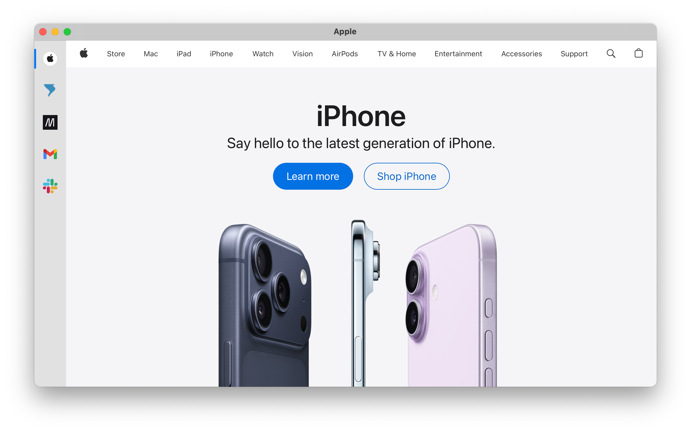

# Vaaka

Vaaka is a macOS browser built for focus and efficiency. It replaces traditional tab management with a fixed, predefined site list that you configure in settings. Each whitelisted site gets one tab on the left sidebar. Leaving the whitelisted sites opens your default browser. No address bar, no mess of tabs, just the sites you whitelist.

## Vaaka - "Vah-kah" (Finnish)

Means "scale" or "balance."

### Background

The idea came from the Fluid app from back in the day, where I could whiltelist individual sites and have a browser that was specifically for those sites. Think SSB/progressive-web apps, but all in one window.

## How It Works

**Configure Your Sites** - Add your websites in Settings - That's it. Each site gets its own tab in the left sidebar.

### Features

- **Vertical Tabs** - Clean left sidebar with site favicons
- **Keyboard Navigation** - Cmd+Number for quick switching, Ctrl+Tab for cycling
- **Session Persistence** - Window size and active tab are restored on launch
- **Favicon Fetching** - Automatic favicon download with fallback to monochrome icons
- **Content Blocking** - Optional ad/tracker blocking via EasyList integration
- **User-Agent Spoofing** - Appears as Safari to avoid differential treatment
- **Do Not Track Support** - Optional - DNT header for privacy-conscious browsing
- **Local Data Storage** - All data is stored locally; no telemetry collected
- **Notifications** - Native macOS notifications for web alerts (I'm trying, but it's complicated.)
- **Unread Badge Counts** - Visual indicators for unread messages on supported sites (I'm trying, and we're getting closer.)
- **Tab Overview** - Preview all tabs in a grid view for quick navigation
- **Find Bar** - Search within the current page with a built-in find bar

## Installation

Download the latest release from [Releases](https://github.com/twistermc/Vaaka/releases), un-compress, and drag `Vaaka.app` to your Applications folder.

This app is self-signed and notarized by Apple. The first time you open it, you will need to approve it in System Preferences > Security & Privacy. If you download a new version, you'll have to follow the same steps again.

It's not signed because I don't want to pay Apple the fee for a developer account at this time.

## Requirements:

- macOS 14.0 or later
- Apple Silicon (M1+) or Intel

## Donate

If you find Vaaka useful and would like to support its development, consider [making a donation](https://ko-fi.com/twistermc).
Every bit helps and is greatly appreciated!
